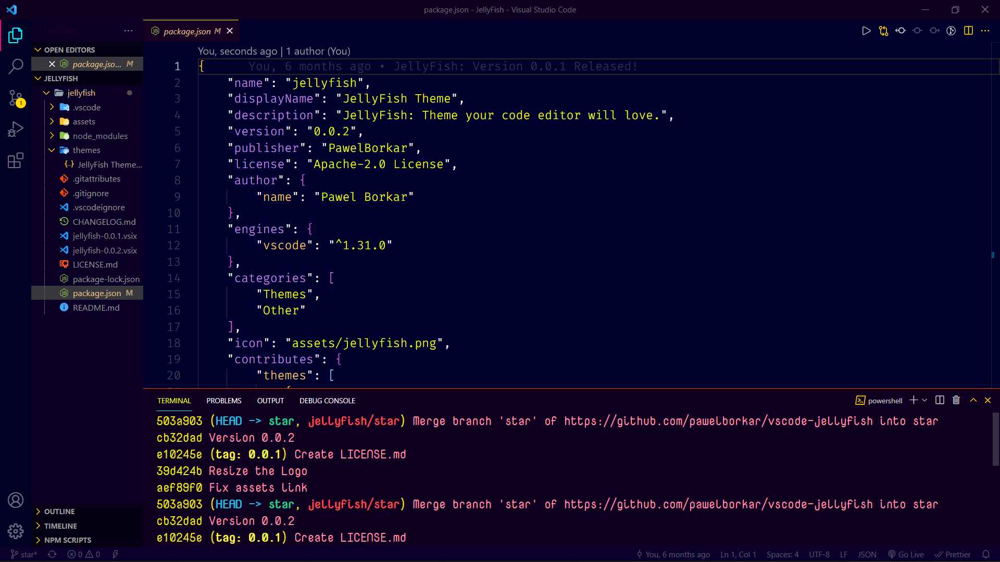
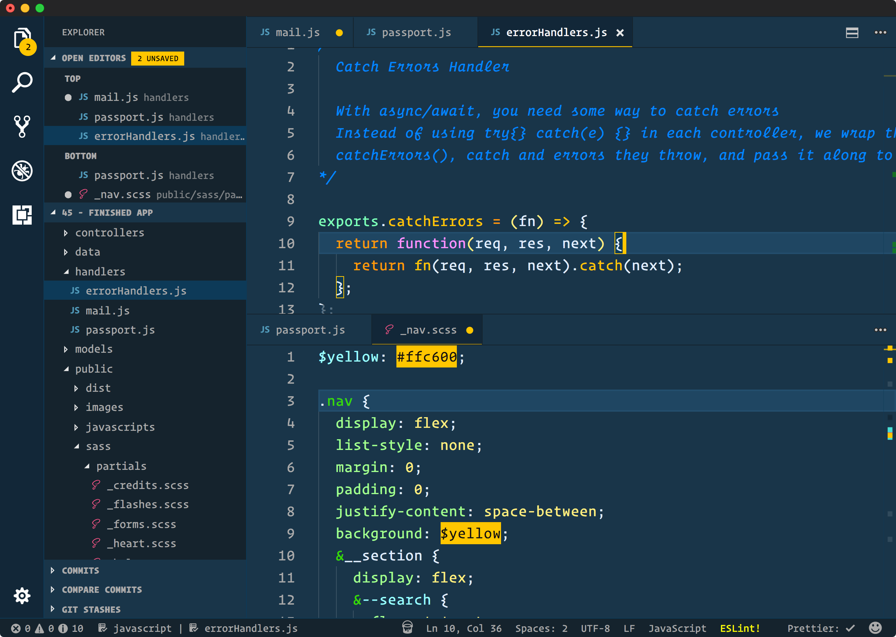
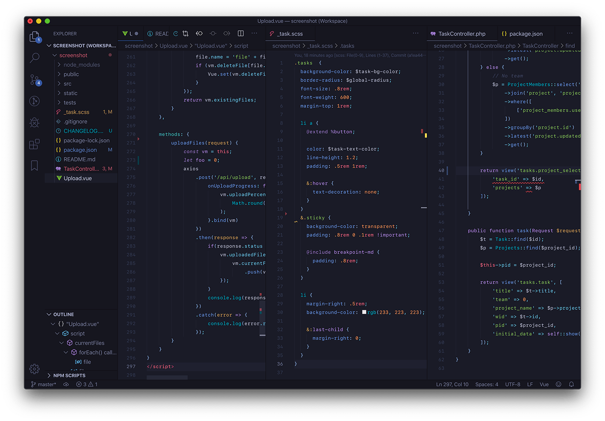
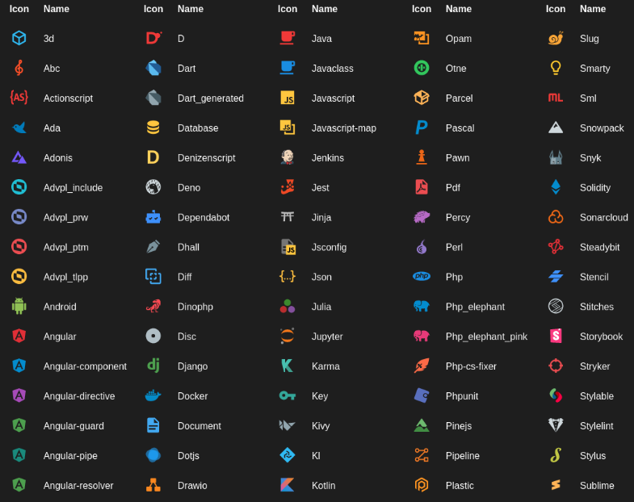

# Deepak Tech Lab

### Work is undeniably a crucial aspect of our lives, but sometimes we may find ourselves feeling bored or uninspired. What if we could enhance our work environment and make it more appealing?

## Allow me to share with you my personal setup for Visual Studio Code, which I have customized to make it both functional and visually stunning.😊

### If your new please follow my Social Media Handle
### [Youtube](https://www.youtube.com/channel/UCxFC2Q-ugXlFXgfvV57L0LA)
### [Instagram](https://www.instagram.com/coder_deepak/)

# Let's start

## Theme:-
**Just copy the theme name and paste it into the VS Code extension search box 👌**
1. ```JellyFish Theme```



**JellyFish theme one of my fevourite theme**

2. ```Cobalt2 Theme Official```



3. ```Tokyo Night```



## Icons:-

1. ```Material Icon Theme```



2. ```vscode-icon```


**Personaly favourite theme Icons**

## Font Family:-

### 1.
`cascadia code',Consolas, 'Courier New', monospace`
> Add it in font setting 

`"editor.fontLigatures": true,`
> Paste it in setting.json file

[Download Link](https://github.com/microsoft/cascadia-code/releases)

